## Grad-CAM implementation in Tensorflow

This repo is a TensorFlow implementation of Gradient class activation maps(Grad-CAM[1]), 
one of visualization techniques for deep learning networks.

This repo is based on [Torch](https://github.com/ramprs/grad-cam) and [Keras](https://github.com/jacobgil/keras-grad-cam) versions of Grad-CAM.

### Requirements
* Python3.x
* Tensorflow 1.x
* [tensorflow-vgg](https://github.com/machrisaa/tensorflow-vgg) 
(which includes the pretrained(using the Imagenet dataset) VGG16 classification model file `VGG16.npy`(see the README on how to download it))

### Usage
 
```bash
python grad-cam-tf.py <path_to_image> <path_to_VGG16_npy> [top_n]
```
* `path_to_image`: an image for which Grad-CAM is calculated.
* `path_to_VGG16_npy`: path to the pretrained VGG16 model data provided in [`tensorflow-vgg`](https://github.com/machrisaa/tensorflow-vgg) 
* `top_n`: Optional. Grad-CAM is calculated for each 'top_n' class, which is predicted by VGG16. 

The following images are saved to the same directory as `path_to_image`:
* input image overlaid by Grad-CAM heatmap with the suffix `gradcam` appended to the `path_to_image`.
* black-and-white Grad-CAM heatmap(suffix: `heatmap`)
* segmented image by Grad-CAM heatmap(suffix: `segmented`)
* Guided Backpropagation[2] (suffix: `guided_bprop`)
* Also rank of predicted class, the class name and the probability are appended as suffix to each file names above.


### Examples

* Example image from the [original implementation](https://github.com/ramprs/grad-cam):  

the most probable class: 'boxer'(242)


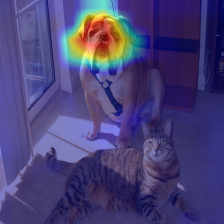
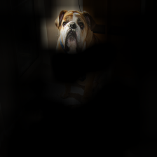

* Image from [3]:  

the most probable class: 'desktop computer'(527)


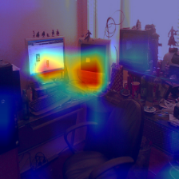


ground truth(the second probable class): 'desk'(526)

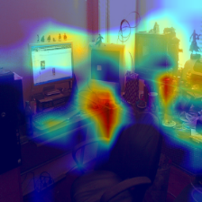
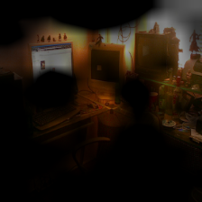

* Image from [fatal crash by Uber self-driving SUV](https://www.wthr.com/article/police-release-video-of-fatal-crash-by-uber-self-driving-suv):  

the most probable class: 'traffic_light'(920)

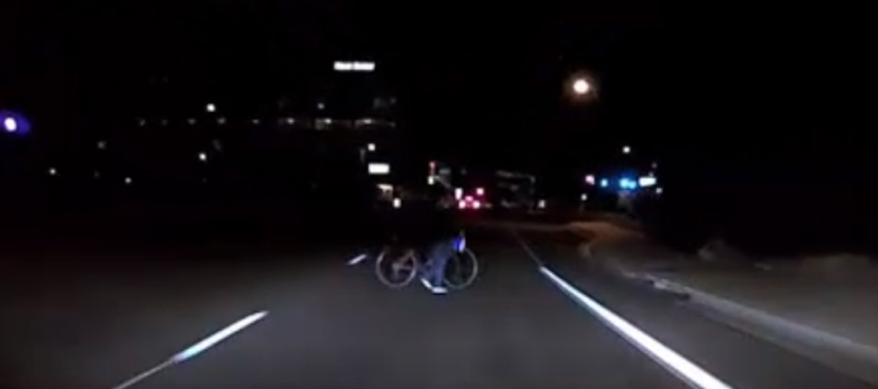
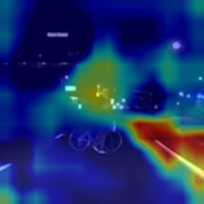
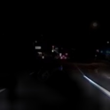

the 6-th probable class: 'motor_scooter'(670)

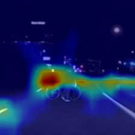
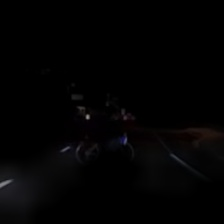

the 19-th probable class: 'moped'(665)

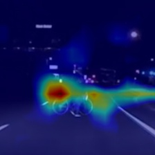
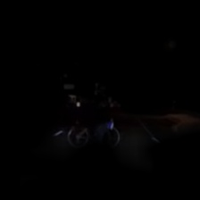

Lines below are the top 20 classes predicted VGG16 model.

As you can see, VGG16 fails to detect bicycle related objects from this picture(though `motor_scooter` is detected with low probability).

```text
0: class id: 920, class name: traffic_light, probability: 0.105, synset: n06874185 traffic light, traffic signal, stoplight
1: class id: 627, class name: limousine, probability: 0.092, synset: n03670208 limousine, limo
2: class id: 475, class name: car_mirror, probability: 0.039, synset: n02965783 car mirror
3: class id: 818, class name: spotlight, probability: 0.038, synset: n04286575 spotlight, spot
4: class id: 971, class name: bubble, probability: 0.037, synset: n09229709 bubble
5: class id: 670, class name: motor_scooter, probability: 0.027, synset: n03791053 motor scooter, scooter
6: class id: 656, class name: minivan, probability: 0.024, synset: n03770679 minivan
7: class id: 845, class name: syringe, probability: 0.024, synset: n04376876 syringe
8: class id: 864, class name: tow_truck, probability: 0.022, synset: n04461696 tow truck, tow car, wrecker
9: class id: 867, class name: trailer_truck, probability: 0.018, synset: n04467665 trailer truck, tractor trailer, trucking rig, rig, articulated lorry, semi
10: class id: 555, class name: fire_engine, probability: 0.016, synset: n03345487 fire engine, fire truck
11: class id: 468, class name: cab, probability: 0.016, synset: n02930766 cab, hack, taxi, taxicab
12: class id: 407, class name: ambulance, probability: 0.015, synset: n02701002 ambulance
13: class id: 736, class name: pool_table, probability: 0.013, synset: n03982430 pool table, billiard table, snooker table
14: class id: 836, class name: sunglass, probability: 0.013, synset: n04355933 sunglass
15: class id: 772, class name: safety_pin, probability: 0.010, synset: n04127249 safety pin
16: class id: 837, class name: sunglasses, probability: 0.010, synset: n04356056 sunglasses, dark glasses, shades
17: class id: 754, class name: radio, probability: 0.010, synset: n04041544 radio, wireless
18: class id: 665, class name: moped, probability: 0.010, synset: n03785016 moped
19: class id: 444, class name: bicycle-built-for-two, probability: 0.009, synset: n02835271 bicycle-built-for-two, tandem bicycle, tandem
```

I think Uber has built in-house classification models for self-driving cars. 
But detecting persons on roads could be difficult only by visible light especially at night. 
As reported in [Report: Uber's Self-Driving Car Sensors Ignored Cyclist In Fatal Accident](https://gizmodo.com/report-ubers-self-driving-car-sensors-ignored-cyclist-1825832504)
it seems a woman crossing the street on a bicycle was ignored.

Detector using an infrared camera is also necessary to avoid such tragic accidents.

## Note

For your information,
`Grad-CAM++`, a variant of `Grad-CAM`, is presented in [4]. The authors provided their [implementation](https://github.com/adityac94/Grad_CAM_plus_plus). 
As pointed by [Questions for computing of derivatives](https://github.com/adityac94/Grad_CAM_plus_plus/issues/1),
their implementation is weird. For example the second derivative(`d2f/dx2`) in [4] is coded like (`(df/dx)^2`),
though the second derivatives should be computed by [`tf.hessians`](https://www.tensorflow.org/api_docs/python/tf/hessians).

So I am not sure if their experimented results in [4] are correct or not.

## References

[1] 
Ramprasaath R. Selvaraju, Michael Cogswell, Abhishek Das, Ramakrishna Vedantam, Devi Parikh, Dhruv Batra.
Grad-CAM: Visual Explanations from Deep Networks via Gradient-based Localization,
[arXiv](https://arxiv.org/abs/1610.02391), 2016

[2] J. T. Springenberg, A. Dosovitskiy, T. Brox, and M. Riedmiller. Striving for Simplicity: 
The All Convolutional Net, [arXiv](https://arxiv.org/abs/1412.6806), 2014

[3] https://pair-code.github.io/saliency/

[4] Aditya Chattopadhyay, Anirban Sarkar, Prantik Howlader, Vineeth N Balasubramanian.
Grad-CAM++: Generalized Gradient-based Visual Explanations for Deep Convolutional Networks,
[arXiv](https://arxiv.org/abs/1710.11063), 2017